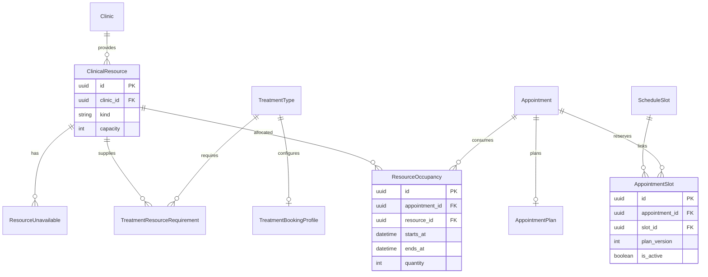

# 预约资源扩展关系图

此图对应已安装的连续预约与资源模型。各模型使用独立UUID主键，一对一关系通过唯一外键实现。

```mermaid
erDiagram
    Clinic ||--o{ ClinicalResource : provides
    ClinicalResource ||--o{ ResourceUnavailable : has
    TreatmentType ||--o| TreatmentBookingProfile : configures
    TreatmentType ||--o{ TreatmentResourceRequirement : requires
    ClinicalResource ||--o{ TreatmentResourceRequirement : supplies
    Appointment ||--o| AppointmentPlan : plans
    Appointment ||--o{ AppointmentSlot : reserves
    ScheduleSlot ||--o{ AppointmentSlot : links
    Appointment ||--o{ ResourceOccupancy : consumes
    ClinicalResource ||--o{ ResourceOccupancy : allocated
    ClinicalResource {
        uuid id PK
        uuid clinic_id FK
        string kind
        int capacity
    }
    AppointmentSlot {
        uuid id PK
        uuid appointment_id FK
        uuid slot_id FK
        int plan_version
        boolean is_active
    }
    ResourceOccupancy {
        uuid id PK
        uuid appointment_id FK
        uuid resource_id FK
        datetime starts_at
        datetime ends_at
        int quantity
    }
```
